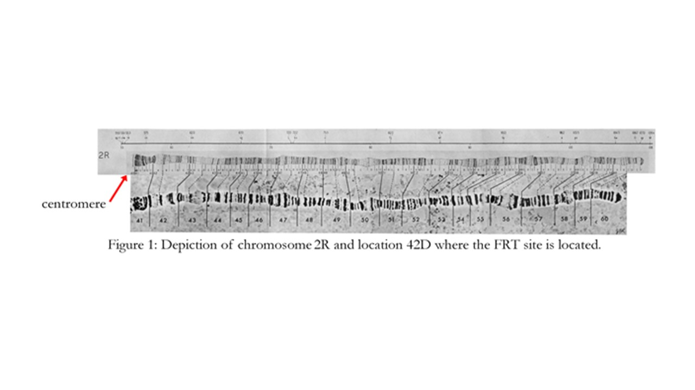
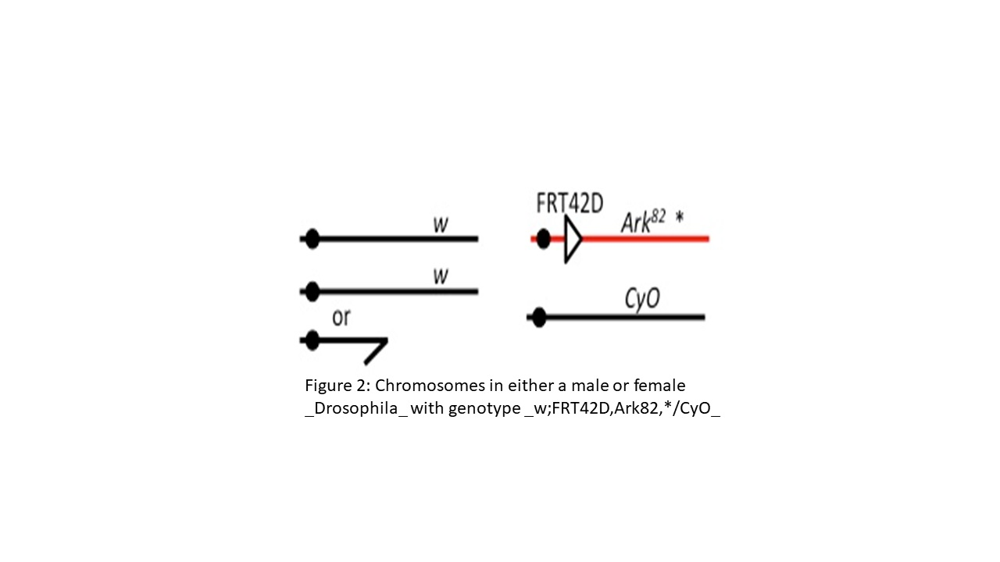
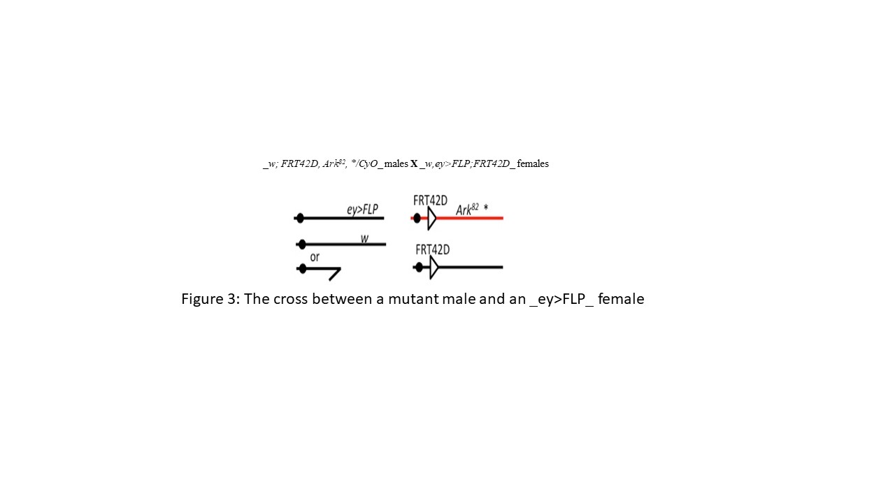
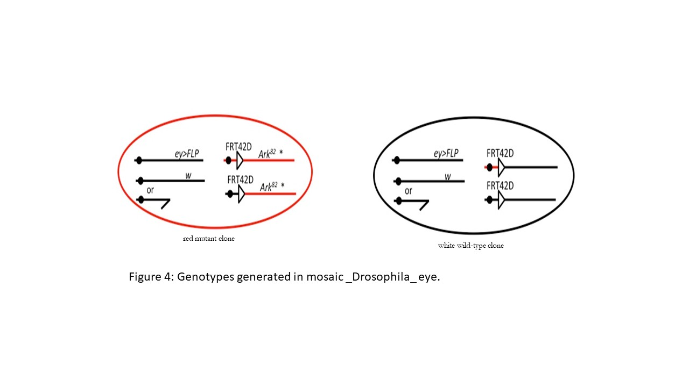

# FlyCURE Manual

## The Genetic Screen to Identify Growth Control Mutants

This week, we will visualize crosses to examine the effect of a particular mutation on growth control in _Drosophila_. This mutation, named XXX, will be the focus of this semester’s lab. In the introduction to genetics research lab, the mutant and control fly phenotypically looked the same. The cross we examine this week, lets us visualize that a mutation is present.

## Pre-Lab
Read the following sections in the paper “Genetics on the fly: A primer on the Drosophila model system” (Hales et al., 2015) posted in the lab module of Canvas or link below:
–	[A Drosophila Genetic Toolkit – A basic forward genetic screen (pages 821-823) and Clonal analysis (pages 825-827)] (https://www.ncbi.nlm.nih.gov/pmc/articles/PMC4649653/)  

### Objectives

1. Understand one strategy for _Drosophila_ mutagenesis.
2. Understand the use of the FLP-FRT recombination system.
3. Examine and interpret mosaic phenotypes.
4. Determine the effect of the mutation on growth control in the _Drosophila_ eye.
5. Visualize the mosaic eye produced from the cross with the control fly x _Ey>Flp;FRT42D_ and a separate cross with the mutant fly x _Ey>Flp;FRT42D_. Look for differences in the mosaic eye between the control and mutant crosses.
6. Understand the Genetic Screen, what crosses were done to conduct the genetic screen, and what it allows you to visualize.  

#### Terms to know:
- _Drosophila melanogaster_
- Stock
- Cross
- Homozygote
- Heterozygote
- Balancer chromosome
- Parental Generation (P)
- First Filial Generation (F1)
- Phenotype
- Genotype
- Mutation
- Apoptosis

### Introduction

#### **A screen to identify growth control mutants in _Drosophila_**

One strategy used by geneticists to identify genes involved in a particular biological process is a genetic screen. Mutations are induced in the experimental organisms, which are then examined to identify individuals with the phenotype of interest. In this lab, we will be analyzing a mutant that were generated in a screen to identify mutations that lead to cell overgrowth in _Drosophila_.

Genes involved in cell division, cell growth, or cell death may interact with each other in complex ways. For example, a mutation that leads to cell overgrowth may trigger programmed cell death (apoptosis) in the mutant cells, so that the overgrowth phenotype is never observed. To circumvent this issue, this genetic screen was performed in flies that carry a mutation in the _Apaf-1-related killer (Ark)_ gene, which is required for most apoptosis in _Drosophila_. In an _Ark_ null mutant, apoptosis is blocked, and therefore any overgrowth caused by an induced mutation will be detectable.

#### **Balancer chromosomes**

Cell overgrowth mutations are generally detrimental to overall fly development. Indeed, the mutations generated in the growth control screen are homozygous lethal. The mutations are therefore maintained as heterozygous stocks over the _CyO_ balancer chromosome. In general terms, the genotype of the mutant stocks are * /_CyO_, where * denotes the EMS mutant chromosome.

Three features of balancer chromosomes make them invaluable for _Drosophila_ genetics:
1.	Balancer chromosomes contain multiple inversions. As you will learn in chapter 8 of your textbook, meiotic crossing-over in the regions of these inversions result in chromosomes that contain duplications and deletions and are therefore inviable. This means that balancer heterozygotes produce only gametes with intact, non-recombinant chromosomes – either the * chromosome or the _CyO_ chromosome.
2.	Balancer chromosomes contain dominant markers so that their presence is easily detected. The _CyO_ balancer carries the dominant _Curly (Cy)_ mutation, which causes the wing to curve upwards instead of lying flat.
3.	Balancer chromosomes contain recessive lethal mutations. This means that the * /_CyO_ stock can be maintained indefinitely, as both the */* and the _CyO/CyO_ genotypes are lethal.

#### **Determining the phenotype of a growth control mutation**

The mutation that we are studying is recessive lethal; heterozygotes have normal growth control (and curly wings) and homozygous mutants are dead. To observe a growth control phenotype, a genetic ‘trick’ is used. This trick induces **mitotic** recombination to generate homozygous mutant patches of cells only in the eye (which is not required for fly survival), while the cells in the rest of the animal remain heterozygous for the mutation. The growth control phenotype can then be studied by examining the eye tissue.

To generate homozygous mutant cells, the yeast FLP recombinase protein is used. This protein induces mitotic recombination between homologous chromosomes at target sites, which are called FRT sites.

In this experiment, the FRT sites are in cytological location 42D on the right arm of the 2nd chromosome. The [figure below](2R_image.jpg) shows this location, which is very close to the centromere.

In the original growth control screen, male flies with the genotype _w;FRT42D,Ark82_ were fed the mutagen ethyl methanesulfonate (EMS), which induces single nucleotide substitutions. These males were then crossed to females containing the _CyO_ balancer chromosome to generate offspring with the genotype _w;FRT42D,Ark82_, * /_CyO_.

The _w;FRT42D,Ark82,*/CyO_ flies have a mutant _white (w)_ gene on the X chromosome. The normal function of the w gene is to produce red eye pigment, and so you would expect these males to have white eyes. However the _Ark_ gene is also mutated in these males, because a _w_ transgene has been inserted into the wild-type _Ark_ gene to create the _Ark82_ mutant allele. These males therefore contain a copy of the _w_ gene on the second chromosome, which offsets the mutant _w_ allele on the X chromosome, and so they have red eyes. This is the genotype of the stocks that you examined in week 1, and is [shown below](Heterozygous_genotype.jpg).

Mitotic recombination is induced when the FLP recombinase binds to FRT sites on both homologous chromosomes. The FLP recombinase and another FRT site-containing second chromosome will be introduced by crossing males from the mutant stock shown in Figure 2 to females of the genotype _w,ey>FLP;FRT42D_. The _ey>FLP_ gene produces FLP recombinase under the control of the _eyeless (ey)_ promoter, which is expressed only in the developing eye. Note that these females are homozygous for the _w_ mutation, and so have white eyes.

The cross is diagrammed below:
[Link to diagrammed _Ey>Flp_Cross](EyFlp_Cross.jpg)

In the presence of FLP recombinase, mitotic recombination between FRT sites occurs. This results in an exchange of chromosome arms distal to the FRT sites, and may lead to cells that are homozygous for either the _Ark82_, * chromosome or the wild type chromosome. Since the _Ark82_ allele contains the _w_ transgene, _Ark82_, * homozygous cells are red. On the other hand, the homozygous wild type cells are white.

[Link to Mosaic eye genotype diagram](Mosaic_eye_genotype.jpg)

## Protocol:
Each laboratory group will collect two vials of progeny from the following crosses:

##### Experimental:
♂ _w;FRT42D,Ark82,EMS mutation/CyO_    X    virgin ♀ _Ey>Flp;FRT42D_

##### Control:

♂ _w;FRT42D,Ark82/CyO_    X    virgin ♀ _Ey>Flp;FRT42D_

Procedure
Utilize the smartphone microscope adapter to take pictures to accurately depict the mosaic eye phenotype in both the mutant and control crosses. Be sure to take multiple pictures of each genotype, as there may be a range of phenotypes in the mosaic eye. Not all mosaic eyes will look identical!

1. In the space below, draw a Punnett Square crossing your P generation for each cross to identify the genotypes of your F1 progeny. In each cross, identify which F1 genotype(s) will have mosaic eyes. Write out the mosaic genotype of those individuals below.

A.	Experimental:
Mosaic Genotype:___________________________________

B.	Control:
Mosaic Genotype:___________________________________

2. Take pictures of both the control and experimental mosaic eyes. Be sure that your images accurately portray any phenotypic differences between the control and experimental mosaic eyes. Try to focus on just the eye to get a clear close-up image.

A.	What is the purpose of a balancer chromosome? What is the phenotype of a
_Drosophila melanogaster_ that has a “second chromosome balancer”?

B.	Distinguish between a stock and a cross.

C.	Describe the phenotype of your mosaic mutant _Drosophila melanogaster_ eye. Compare and contrast the mutant mosaic eye to the control mosaic eye.

D.	Why are these eyes mosaic, while the vast majority of _Drosophila melanogaster_ are either entirely pigmented or unpigmented? Describe the genetic mechanism for the mosaic eye.

E.	What is the purpose of the Ark82 allele? Why is it included in the control cross?

F.	Using the mutant phenotype, name your mutation:

### **Data:**
By the end of lab today, use CamScanner to take pictures and upload the pages with questions from your lab manual to the assignment link in canvas as a pdf.
Before laboratory next week, create the following figure (be sure to include a descriptive figure caption/legend, text, and title) and upload to canvas before lecture. For help with what these mean, see your Handbook for Writing in Biology (pgs. 67-70). This should be the only figure submitted.  

**Figure 1:**
Depiction of the (A) mosaic Control and (B) mosaic Experimental eyes.
